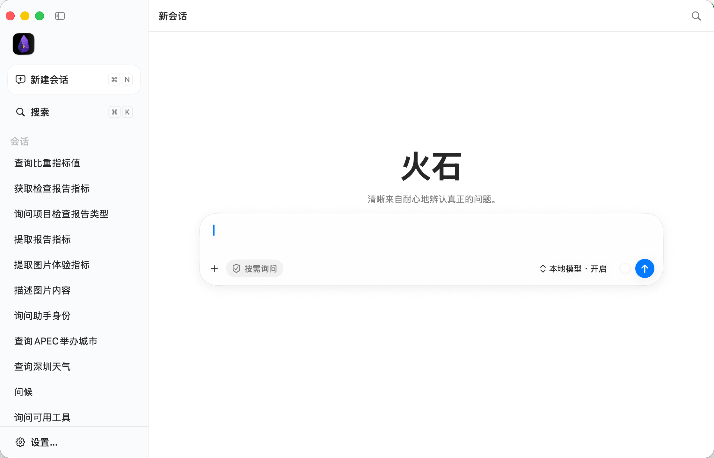
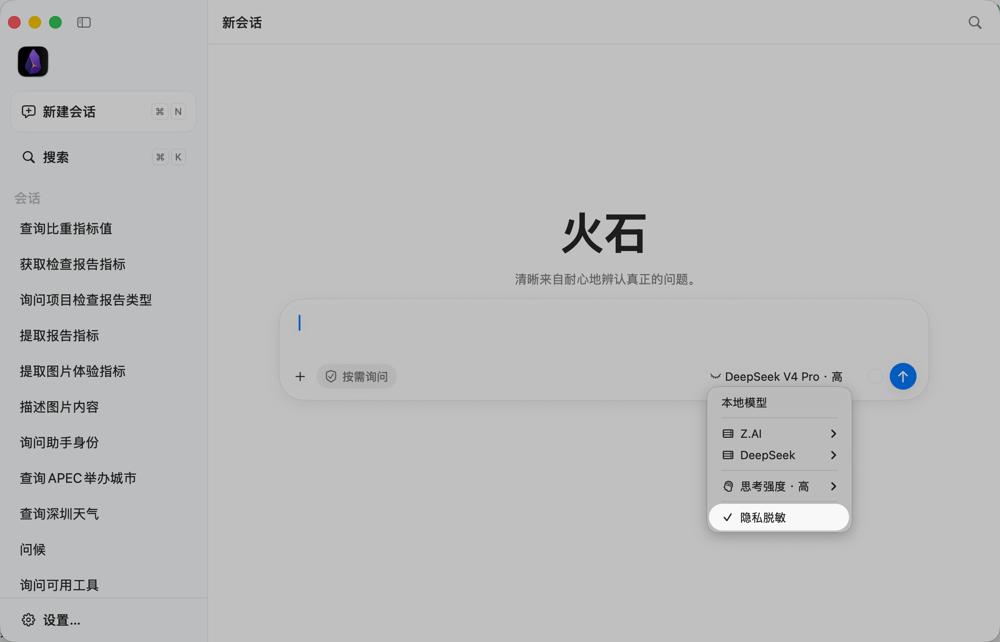
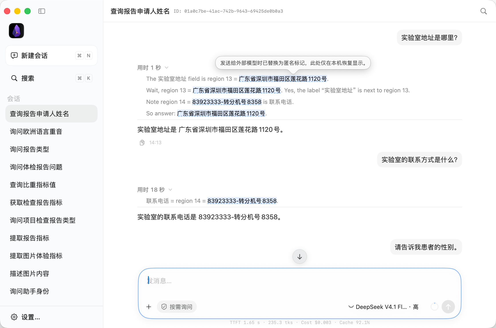
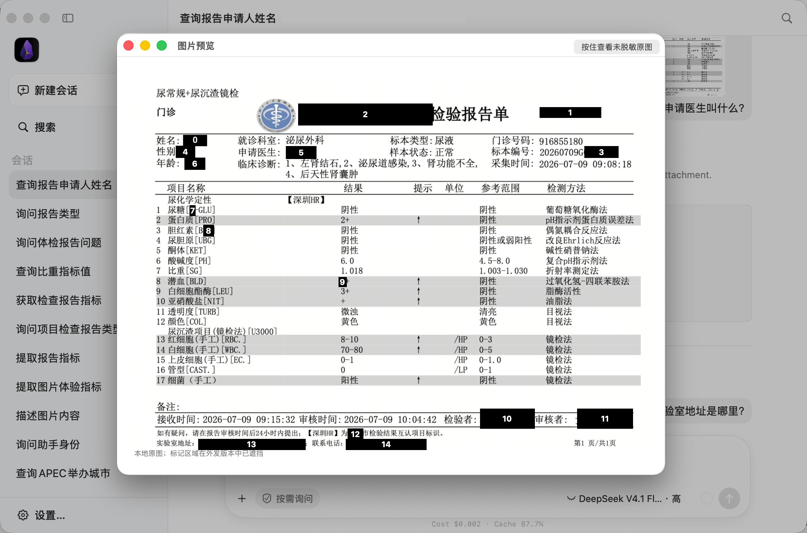
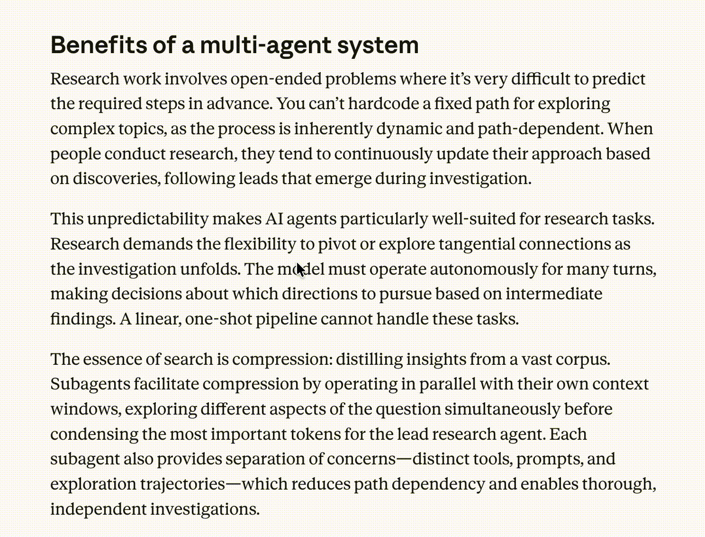
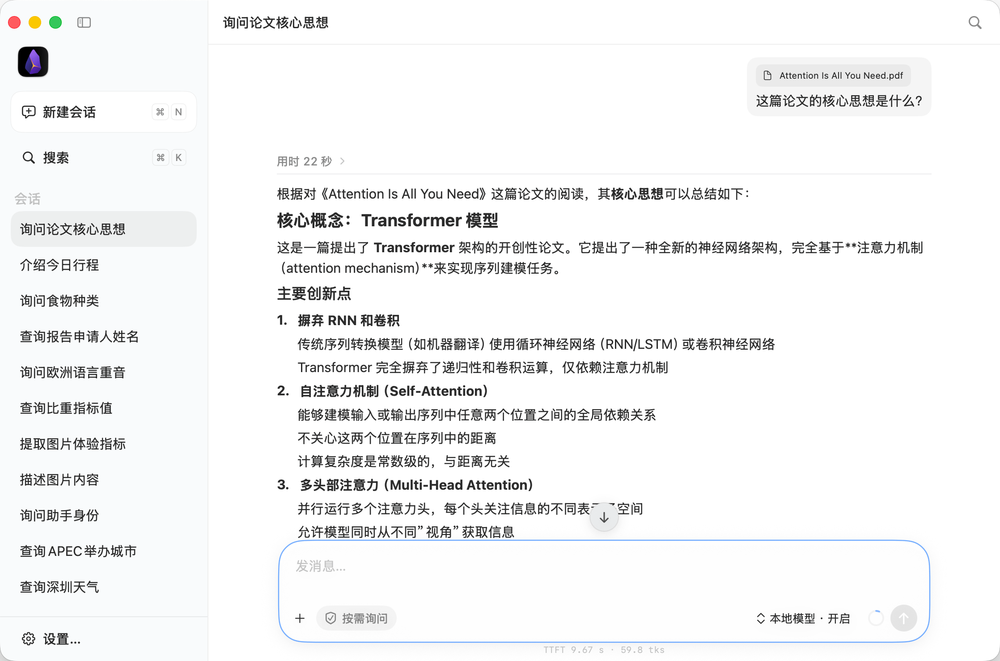
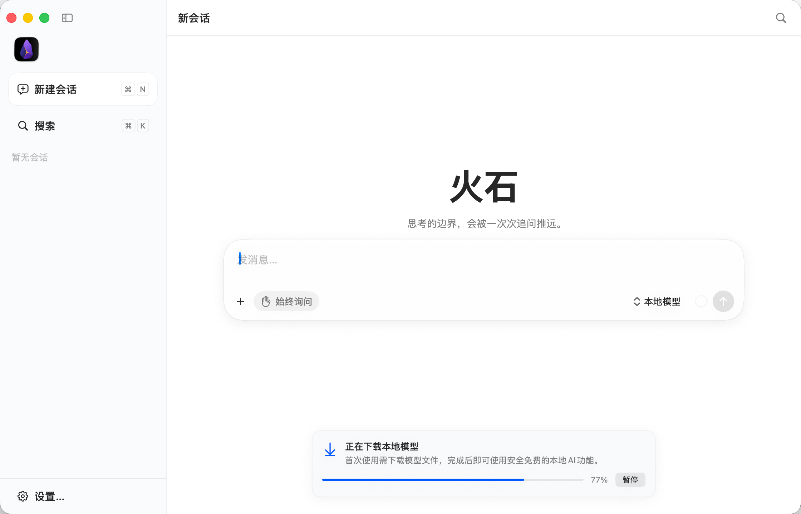

# Fireflint
## Bring AI into your workflow. Keep privacy in your hands.

**English | [中文](README_CN.md)**

Fireflint is an AI assistant for macOS. Select text, capture your screen, or drop in a document to translate, summarize, research, and analyze.

From quick text tasks to multi-step workflows, Fireflint combines local models, external AI services, and privacy protection—so you can pick the right AI for each task and always know how your data is used.

---

## Everyday tasks, handled locally

Translate a passage, explain a term, or summarize what you've selected—nothing has to leave your device.

Fireflint ships with a local AI model that translates, explains, and summarizes selected text right on your Mac. Screenshot text recognition runs on macOS's built-in OCR. You can also chat with the local model about any text, images, or documents you give it.

**Select, act, and keep going—with AI built into your desktop workflow.**

## Cloud power, with an extra layer of privacy

When a complex task calls for an external model, connect your preferred provider and turn on privacy redaction. It's on by default for external models.

Before anything is sent, Fireflint detects and processes sensitive information locally—names, contact details, addresses, credentials—while keeping the structure the task depends on.

Images are analyzed locally too, and masked where needed before they're used.

Add your own sensitive terms and field labels, and correct individual false positives, so the protection fits the way you actually work.

**An extra layer of protection between your Mac and the cloud—configured by you.**

## Gets work done, within clear permission boundaries

Fireflint can research online, read files, and use tools to organize text and process data.

All of this runs in a controlled environment: file access stays within the workspaces you authorize, attachments are read-only, and network access and integrations follow permission policies.

Review each request yourself, or turn on **“Approve for me”** and let a local model vet task-related operations. Anything uncertain comes back to you, and high-risk write operations always need your approval.

**Let AI do more of the work—while the important calls stay with you.**

---

## From a line of text to a finished task

### Translate and understand
Select text to translate it, look up words, unpack concepts, or pull out key points. Results show up in a floating window, ready to copy or explore further.

### Ask about your screen
Capture a window or drag across a region to extract text, translate what's there, or ask AI about the image.

### Read documents, extract insights
Work with PDFs, Word documents, Excel spreadsheets, and PowerPoint files. Find the passages that matter and pull out the key information. Local OCR reads scanned PDFs, and embedded images can be inspected on demand.

### Research and organize
Search the web, read the sources, and turn scattered information into answers with citations you can verify.

### Local and cloud AI, working together
A cloud-based lead agent can hand suitable subtasks—like file processing or image understanding—to a local agent.

---

## A desktop assistant for everyday use

- **Choose your models:** Use the built-in local model or connect external AI services.
- **Pick up where you left off:** Save, search, pin, and restore conversations, with long-term memory across sessions.
- **Make it yours:** Customize shortcuts, toolbars, excluded apps, and appearance.
- **Downloads without the fuss:** Pause and resume model downloads, with integrity checks built in.
- **Permissions only when needed:** Accessibility enables text selection; screen recording is requested the first time you capture your screen.

---

## Privacy means being honest about the limits

Local inference doesn't mean everything stays offline. Web searches and third-party integrations still send the necessary data to their respective services. Redaction reduces the sensitive information exposed to external model providers, but it can't guarantee every sensitive detail gets caught.

Fireflint puts model choice, privacy protection, and tool authorization in your hands as separate controls—so every capability comes with boundaries you can see.

**Fireflint—AI that starts local and works the way you do.**

*Requires macOS 14 or later. Available in English and Chinese. Local AI requires a one-time model download.*
